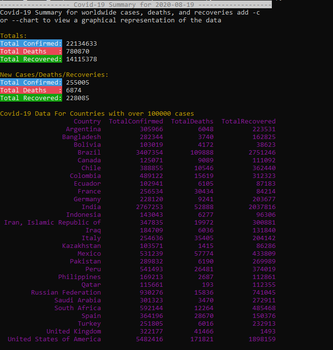
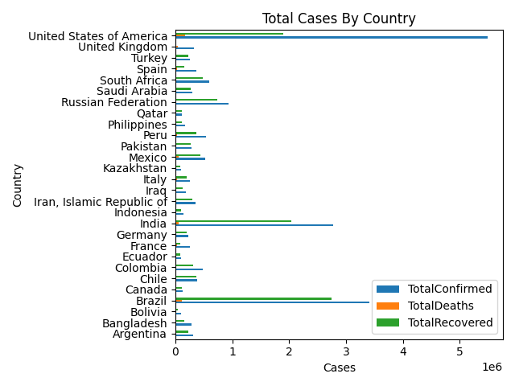
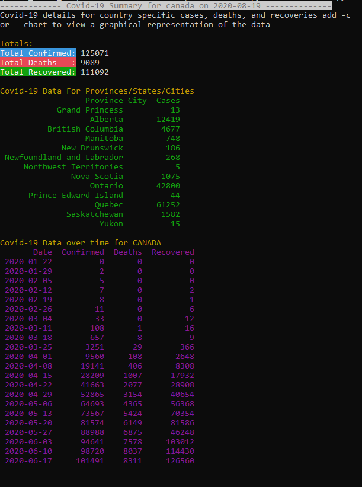
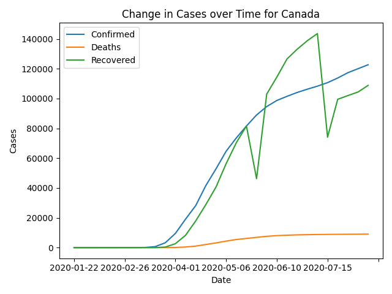

# Covid Stats:

Covid Stats is a python command line application that allows users to view up to date Covid-19 information using the [Coivd-19 API](https://covid19api.com/).

The Project makes use of several python libraries including:
* colorama
* matplotlib
* pandas
* requests 

## Installation
Use pip to install the required libraries 
```bash
pip install -r requirements.txt
```

## Usage 
```bash
# To view a summary of all Covid-19 data 
python covidstats.py -s 
# To view country specific data
python covidstats.py -d <country name>
# Add -c to view the corresponding graphs 
python covidstats.py -s -c
python covidstats.py -d <country name> -c
```

## Screenshots 






## Author
Shivam Sood